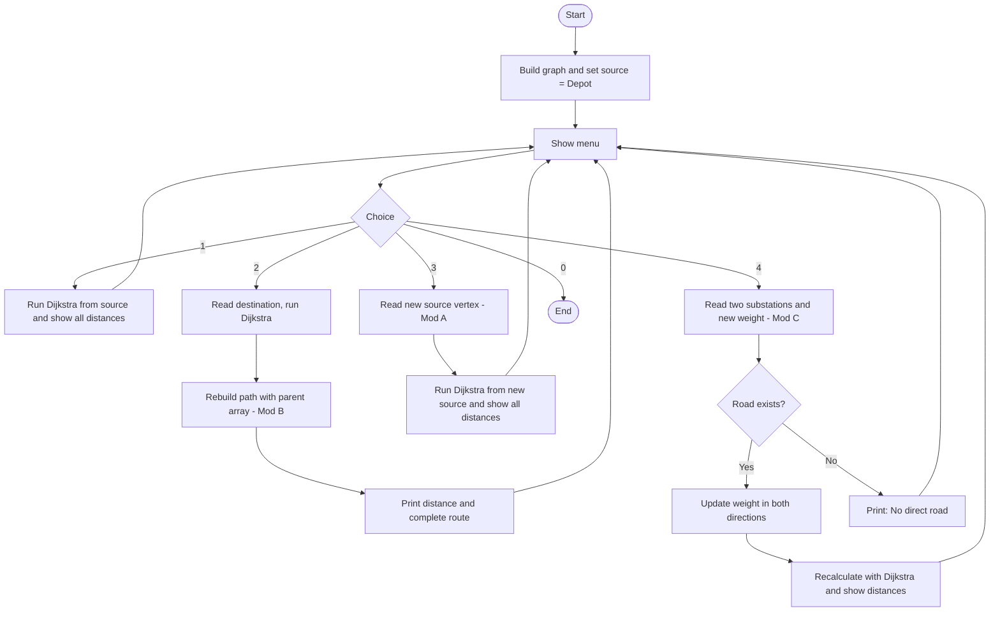

# Flowchart - Modified Program

```mermaid
flowchart TD
    A([Start]) --> B["Build graph and set source = Depot"]
    B --> C["Show menu"]
    C --> D{"Choice"}
    D -- "1" --> E["Run Dijkstra from source and show all distances"]
    D -- "2" --> F["Read destination, run Dijkstra"]
    F --> G["Rebuild path with parent array - Mod B"]
    G --> H["Print distance and complete route"]
    D -- "3" --> I["Read new source vertex - Mod A"]
    I --> J["Run Dijkstra from new source and show all distances"]
    D -- "4" --> K["Read two substations and new weight - Mod C"]
    K --> L{"Road exists?"}
    L -- Yes --> M["Update weight in both directions"]
    M --> N["Recalculate with Dijkstra and show distances"]
    L -- No --> O["Print: No direct road"]
    D -- "0" --> P([End])
    E --> C
    H --> C
    J --> C
    N --> C
    O --> C
```
