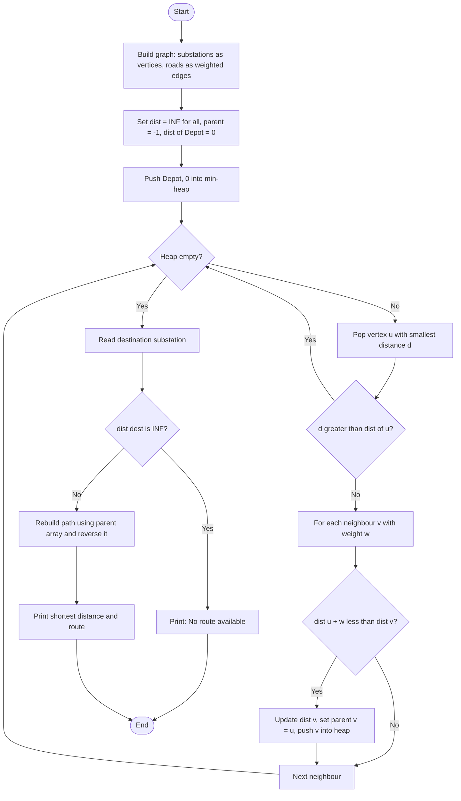

# Flowchart - Original Program

```mermaid
flowchart TD
    A([Start]) --> B["Build graph: substations as vertices, roads as weighted edges"]
    B --> C["Set dist = INF for all, parent = -1, dist of Depot = 0"]
    C --> D["Push Depot, 0 into min-heap"]
    D --> E{"Heap empty?"}
    E -- No --> F["Pop vertex u with smallest distance d"]
    F --> G{"d greater than dist of u?"}
    G -- Yes --> E
    G -- No --> H["For each neighbour v with weight w"]
    H --> I{"dist u + w less than dist v?"}
    I -- Yes --> J["Update dist v, set parent v = u, push v into heap"]
    I -- No --> K["Next neighbour"]
    J --> K
    K --> E
    E -- Yes --> L["Read destination substation"]
    L --> M{"dist dest is INF?"}
    M -- Yes --> N["Print: No route available"]
    M -- No --> O["Rebuild path using parent array and reverse it"]
    O --> P["Print shortest distance and route"]
    N --> Q([End])
    P --> Q
```
